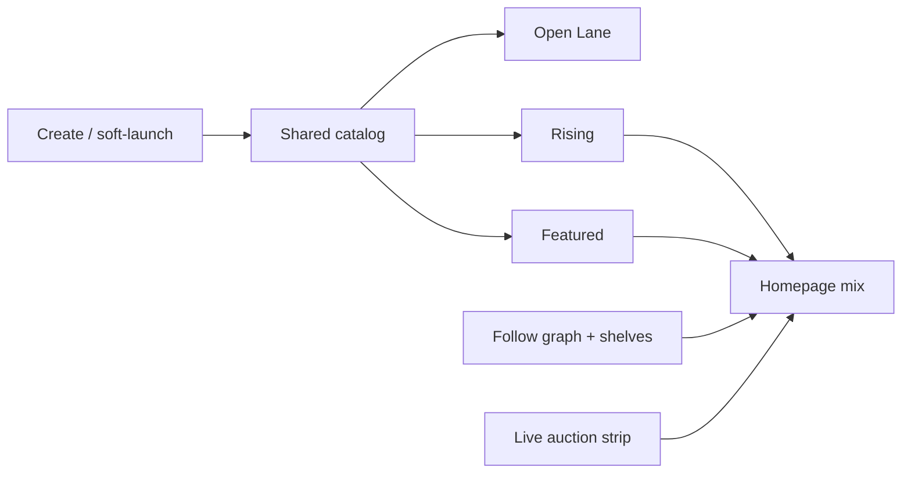

# FreshMint discovery system

FreshMint’s differentiator is **deliberate attention allocation**. Discovery is treated as scarce inventory with rules — not a chronological dump and not pure celebrity ranking.

Settlement is chain-specific (EVM Sepolia / Solana Devnet). **Identity, ranking, and feeds are off-chain and chain-agnostic** so Solana-native new artists are not siloed.

Source of truth in code: `src/lib/discovery/` (especially `config.ts`, `engine.ts`).

---

## Product thesis

Most marketplaces fail new artists in one of two ways:

1. **Chronological dumps** → spam and whales drown everything  
2. **Winner-take-all ranking** → established names stay on top forever  

FreshMint allocates scarce attention deliberately via lanes, quotas, staging, and anti-congestion controls.

**Non-negotiables**

1. Homepage is a **composed discovery product**, not a global activity firehose  
2. **Emerging quota is enforced in code**, not a marketing promise  
3. Anyone can list; **not everyone gets the same attention**  
4. Collectors amplify; algorithms allocate; editors set taste — none alone own discovery  
5. Congestion is managed with **slot caps, decay, and diversity rules**

---

## Surfaces

| Surface | Route | Purpose | Congestion control |
|---|---|---|---|
| **Open Lane** | `/open` | Permissionless browse by chain, type, medium, price, search | Rate limits, filters; not dumped on homepage |
| **Rising** | `/rising` | Fair discovery for newer artists | Daily slot budget; **40% Emerging reserved**; scoring + decay |
| **Featured** | `/featured` | Trust / quality / campaigns | Fixed inventory (12 slots/day) |
| **Homepage** | `/` | Personalized composed mix | Hard mix ratios + 1 artist per screen |
| **Shelves** | `/shelves` | Collector curations | Follow shelves → homepage Following bucket |
| **Calendar** | `/calendar` | OE / auction start windows | Hourly start caps |



---

## Homepage feed mix

Locked in `DISCOVERY_CONFIG.feedMix` (must sum to 1):

| Bucket | Share |
|---|---|
| Emerging Rising | 40% |
| Following (artists + shelves you follow) | 25% |
| Featured / editorial | 20% |
| Live auctions | 15% |

Diversity: **max 1 artist per screen**; collection flood capped per session.

Anonymous visitors currently fall back to a demo Following persona for cold-start mix; signed-in users get their real Follow graph.

---

## Listing lifecycle (stages)

```
draft → soft_launch → rising_eligible → featured_eligible → featured
```

| Stage | Visibility |
|---|---|
| `draft` | Private |
| `soft_launch` | Profile + Open Lane |
| `rising_eligible` | + Rising |
| `featured_eligible` | Rising (awaiting Featured slot) |
| `featured` | + Featured lane |

### Soft launch gates

- Must be draft  
- Title + media hash + metadata complete  

### Rising gates

- Must be soft-launched  
- Metadata complete, original media  
- Creator not flagged / not wash cluster / not delisted  
- **New-wallet cooldown** before Rising (72h default)  
- **Max 3 Rising entries per creator per week**  
- OE / auction window validity when applicable  

### Featured

- Nomination / editorial path into `featured_eligible`  
- Editors promote into fixed Featured inventory via Studio  
- Featured dominance can block further Rising saturation for that creator  

Implemented in `src/lib/discovery/staging.ts`.

---

## Emerging eligibility

Emerging is **game-resistant** and ignores external follower fame. Verified badge is **not** required.

A creator is Emerging if **any** of these hold, **and** they are not flagged / wash:

- Lifetime primary volume &lt; **$5,000**, or  
- Completed sales &lt; **10**, or  
- First listing within **90 days** (or no first listing yet)

Then Rising applies a hard **Emerging quota** (default **40%** of Rising slots) after scoring and OE concurrency caps.

See `src/lib/discovery/emerging.ts` and `quotas.ts`.

---

## Scoring (Rising / Featured candidates)

```
score = quality × novelty × diversity × spam_inverse × impression_decay × temporal
```

| Factor | Intent |
|---|---|
| **quality** | Saves, follows, dwell, unique viewers, nominations (not raw clicks alone) |
| **novelty** | Boost when artist/collection has low prior platform exposure |
| **diversity** | Downrank if same artist already on this screen / session |
| **spam_inverse** | Report rate, new wallet, flags |
| **impression_decay** | Fair-share daily/weekly impressions before hard decay |
| **temporal** | OE drop burst; auction ending-soon boost |

Listing types get discovery weights (1/1 singles slightly favored; collections surface hero + samples until traction).

---

## Attention budgets (defaults)

From `DISCOVERY_CONFIG`:

| Budget | Default |
|---|---|
| Rising slots / day | 36 |
| Emerging share of Rising | 40% |
| Featured slots / day | 12 |
| Max concurrent OE on Rising | 3 |
| Live auction strip slots | 6 |
| Rising entries / creator / week | 3 |
| Open Lane listings / creator / day | 25 |
| Impression fair-share / day | 2,000 |
| Impression fair-share / week | 8,000 |
| Meaningful view dwell | 3,000 ms |

---

## Congestion & integrity

### Listing controls

- Open Lane daily caps; Rising weekly caps  
- OE / auction calendar: max starts per UTC hour, min/max window lengths  
- Collections: hero + sample set in feeds until traction  

### Quality / spam

- Mandatory media hash + metadata completeness  
- Near-duplicate media detection  
- Report → pressure → delist; appeals path  
- Nomination stake: cost curator points; moderators settle success vs abuse  

### Sybil-lite (signals)

- Max signals per viewer×listing per hour  
- New-account engagement caps  
- Self-engagement blocked for save/follow  
- Wash-purchase heuristics on repeated buyer↔seller pairs  

### Collector amplification

- Follow artists → homepage Following bucket  
- Collector shelves (Studio) can be followed  
- Nominations stake reputation into Rising path  

---

## Metrics that prove the wedge

Tracked in `MetricsCollector` and shown at `/metrics`:

- Emerging share of impressions  
- Emerging share of first purchases  
- Feed entropy (artist diversity)  
- Spam rate / duplicates blocked / Rising abuse  
- Time-to-first-meaningful-view (Emerging)  
- Retention proxy for collectors who buy Emerging  

If Emerging impressions are high but conversion is zero → ranking too random.  
If volume leaders capture most Rising → fairness is broken.

---

## Code map

| Concern | Module |
|---|---|
| Locked constants | `src/lib/discovery/config.ts` |
| Orchestration | `src/lib/discovery/engine.ts` |
| Emerging | `emerging.ts` |
| Scoring | `scoring.ts` |
| Quotas / strips | `quotas.ts` |
| Homepage mix / Open filters | `feed-mix.ts` |
| Stages / visibility | `staging.ts` |
| Rate limits, dupes, nominations, reports | `anti-spam.ts` |
| Metrics | `metrics.ts` |
| Persistence bridge | `src/lib/marketplace/service.ts` → `getDiscoveryEngine()` |

Unit tests: `src/lib/discovery/__tests__/discovery.test.ts`.

---

## Related in-app pages

- Live rules for collectors: **`/docs`**  
- Live wedge metrics: `/metrics`  
- Drop congestion: `/calendar`  
- Editorial Featured + shelves: `/studio`  
- Reports / nomination settle: `/moderate`
